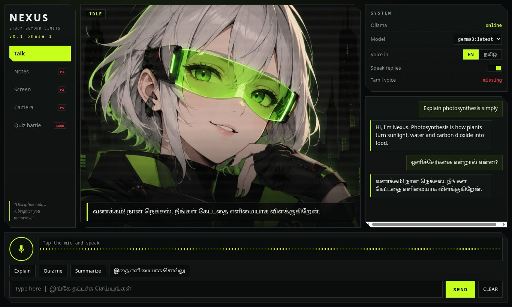

# NEXUS

**Study beyond limits.** A free, local AI study buddy you can talk to in **Tamil and English**.
Runs on your own laptop with [Ollama](https://ollama.com). No cloud AI, no API keys, no cost.

## Phase 1 (this version): voice chat

- Talk with the mic or type, in Tamil or English
- Streaming replies from a local Ollama model, spoken back sentence by sentence
- Dark HUD interface with a live waveform and a character that reacts (listening, thinking, speaking)
- Pick any model you have pulled in Ollama from the panel
- Chats stay on your laptop (browser storage)

Coming next: your own notes with citations (phase 3), reading your screen on request (phase 4),
camera and phone (phase 5). Locked items are shown in the menu.

## Built for a modest laptop

Target laptop: RTX 3050 with 6 GB VRAM and 16 GB RAM. Not yet tested on that machine; the interface was tested against a mock Ollama only. Default model: `gemma3` (about 3.3 GB).
Fallback if it is slow: `llama3.2:3b`. Everything else is the browser plus a tiny Python server
(standard library only, nothing to `pip install`).

## Run it on Windows

1. Install **Ollama** from https://ollama.com/download and open it once.
2. Open **PowerShell** and run: `ollama pull gemma3` (one time, about 3.3 GB download).
3. Install **Python 3** from https://www.python.org/downloads/ (tick "Add python.exe to PATH").
4. Download this repo (green **Code** button, **Download ZIP**, extract) or `git clone` it.
5. Double-click **run.bat**. Your browser opens at http://localhost:8080.
6. Use **Chrome or Edge**. Allow the microphone when asked.

Stop it by closing the black window.

## Notes and limits

- Voice input uses the browser's speech recognition (Chrome/Edge). It needs internet and sends your
  audio to the browser vendor's speech service. The AI model itself stays fully local.
- Tamil voice output needs a Tamil voice on Windows (Settings, Time and language, Speech, Add voices).
  Without it Nexus still answers in Tamil text. Edge usually has online Tamil voices.
- Small models make mistakes, especially in Tamil. Check important answers against your notes.
- The portrait is an AI-generated original illustration, not a copy of an existing character.

## Files

- `server.py` serves the page and forwards chat to Ollama
- `web/` the interface (`index.html`, `style.css`, `app.js`)
- `tools-mock-ollama.py` a fake Ollama used for testing the interface without a GPU

## Licence

MIT
